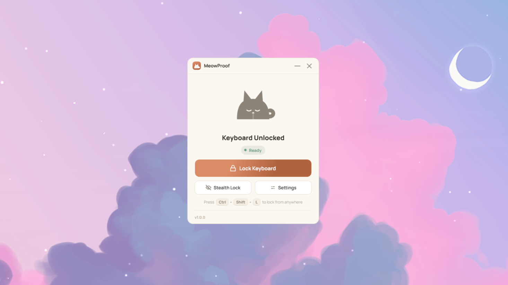
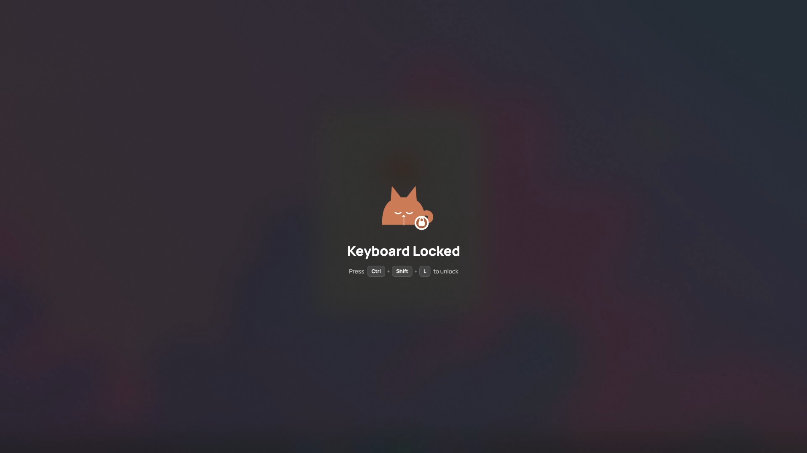
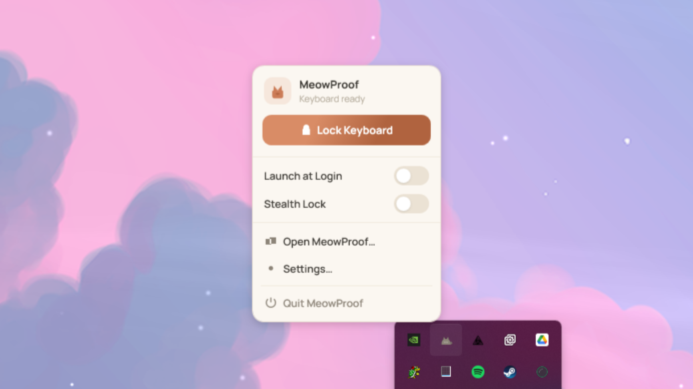
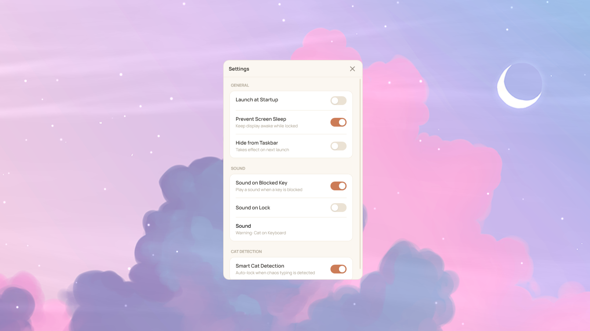
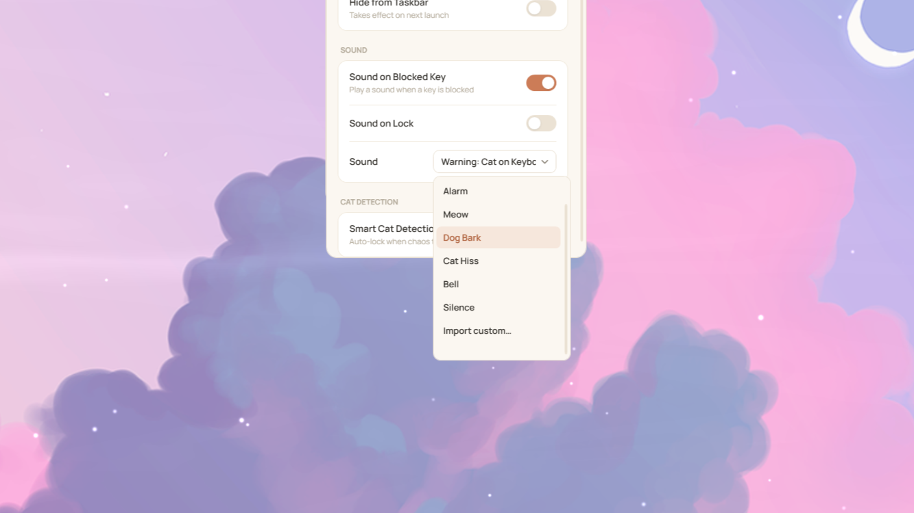

<div align="center">


# MeowProof

**Lock your keyboard so your cat can't interfere.**

A lightweight Windows system-tray utility that instantly disables keyboard input
when your cat decides your keyboard is the best place to nap — so you don't come
back to 400 lines of `jjjjkkkkkkaaaa` and a closed document.




</div>

---

## Why

Cats love warm keyboards. A single paw-press can fire off shortcuts, rename
files, send half-typed messages, or close your work. MeowProof lets you lock the
keyboard in one click (or one keystroke) and unlock it with a shortcut your cat
can't reproduce.

## Features

- **One-click keyboard lock** — blocks every key system-wide via a low-level hook
- **Global unlock shortcut** — `Ctrl + Shift + L` locks and unlocks from anywhere
- **Smart cat detection** — auto-locks when it spots chaotic "paw-walking" typing
- **Glassmorphism overlay** — a full-screen blur tells you it's locked (per-monitor)
- **Stealth Lock** — lock silently with no overlay
- **Sounds** — optional sound on lock and on each blocked key (7 built-in + import your own)
- **Prevent display sleep** while locked, and **auto-unlock** on sleep or session lock — so you're never locked out
- **Launch at login** — self-healing registry entry even if you move the exe
- Warm "paper & terracotta" theme with a fully custom WPF tray menu

## Screenshots

<table>
  <tr>
    <td align="center" width="50%">
      <br/>
      <sub><b>Locked overlay</b> — glassmorphism blur while the keyboard is locked</sub>
    </td>
    <td align="center" width="50%">
      <br/>
      <sub><b>Tray menu</b> — lock, toggles, and quick actions</sub>
    </td>
  </tr>
  <tr>
    <td align="center" width="50%">
      <br/>
      <sub><b>Settings</b> — startup, sleep, sound, and cat detection</sub>
    </td>
    <td align="center" width="50%">
      <br/>
      <sub><b>Sound selector</b> — 7 built-in sounds or import your own</sub>
    </td>
  </tr>
</table>

## Download & run

MeowProof ships as a **single self-contained `MeowProof.exe`** — no installer and
no .NET runtime required.

1. Download `MeowProof.exe`.
2. Put it anywhere (Desktop, a folder, wherever you like).
3. Double-click it. It starts in the system tray.

To start it automatically with Windows, open **Settings → Launch at Login** (or
the tray menu). It registers itself in your per-user startup — no admin rights
needed — and repairs the path automatically if you move the exe later.

## Usage

- **Lock:** click **Lock Keyboard** in the window or tray, or press `Ctrl + Shift + L`.
- **Unlock:** press `Ctrl + Shift + L` (works even while everything else is blocked).
- **Stealth Lock:** locks without showing the overlay.
- **Cat detection:** when enabled, MeowProof watches for cat-like typing and locks
  on its own, showing a tray notification.

> **Note:** because Windows protects elevated windows, a non-administrator hook
> can't block keystrokes inside apps running as administrator (e.g. Task Manager).

## How cat detection works

MeowProof watches your keystrokes in the background without ever blocking them. It scores recent input across four signals — how fast keys are hit, how random they are, how many are held at once, and how long they stay pressed — and auto-locks when the pattern looks more like a paw than a person.

| Signal | Human | Cat |
|---|---|---|
| Time between keys | steady rhythm | rapid bursts, keys dragged across |
| Key variety | repeating, intentional | random — letters, numbers, symbols all at once |
| Keys held at once | 1–2 | 3–6 — a whole paw resting |
| Hold duration | short taps | long holds — sitting on a key |

It resets after 5 seconds of no input and never interferes with your own typing.

## Build from source

Requires the [.NET 8 SDK](https://dotnet.microsoft.com/download).

```bash
# clone, then:
dotnet run                 # build and launch (Debug)
```

Produce the single-file release build:

```bash
dotnet publish -c Release
# output: bin/Release/net8.0-windows/win-x64/publish/MeowProof.exe
```

## Tech

- **C# 12 · .NET 8 · WPF** for the UI, with WinForms `NotifyIcon` for the tray
- Low-level keyboard hook (`WH_KEYBOARD_LL`) for blocking and detection
- `RegisterHotKey` for the global unlock shortcut
- Windows acrylic compositor (`SetWindowCompositionAttribute`) for the overlay blur
- Settings persisted as JSON in `%AppData%\MeowProof\`

## License

Released under the [MIT License](LICENSE).
